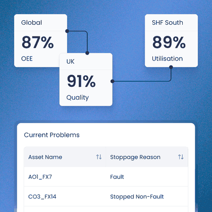

[![Website][badge_website]][link_website]
[![Twitter][badge_twitter]][link_twitter]
[![LinkedIn][badge_linkedin]][link_linkedin]

## Who We Are

We are Razor. We build cutting-edge data and AI solutions. We help complex businesses automate processes, boost efficiency, and uncover real growth.

## What We Do

We design custom software to solve your toughest operational challenges. Our team combines advanced technology with a straightforward, human approach. We build powerful tools you can trust, without the confusing tech jargon.

## Introducing DataQI

<table>
  <tr>
    <td width="58%" valign="top">
      
DataQI is our enterprise manufacturing optimisation platform. It connects your live machine data with intelligent AI agents and everyday operational workflows.

      
<strong>How it helps your factory:</strong>

      <ul>
        <li><strong>Connects data:</strong> Links your machinery directly to your team.</li>
        <li><strong>Streamlines work:</strong> Automates tasks to reduce daily friction.</li>
        <li><strong>Sharpens insights:</strong> Uses AI to find instant operational wins.</li>
      </ul>
    </td>
    <td width="42%" valign="top">
      
    </td>
  </tr>
</table>

[badge_website]: https://img.shields.io/badge/Website-Razor_Ltd-9B4CED?style=for-the-badge&labelColor=382A5F&logo=rss&logoColor=white
[link_website]: https://www.razor.co.uk

[badge_twitter]: https://img.shields.io/badge/Twitter-razor__uk-9B4CED?style=for-the-badge&labelColor=382A5F&logo=twitter&logoColor=white
[link_twitter]: https://twitter.com/razor_uk

[badge_linkedin]: https://img.shields.io/badge/LinkedIn-Razor_Ltd-9B4CED?style=for-the-badge&labelColor=382A5F&logo=linkedin&logoColor=white
[link_linkedin]: https://linkedin.com/company/razorltd
